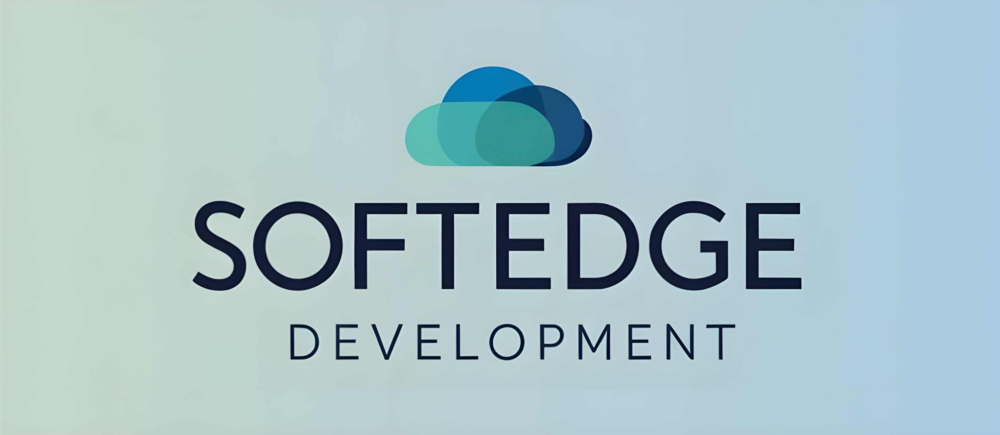

  
  
  # SoftEdge Development
  
  **🚀 Innovative Software Solutions for Modern Businesses**
  
  
  
  
  
  
  ---
  
  **Leading Seattle-based software development company specializing in full-stack web development, quality assurance automation, and user experience design.**
  
  [🌐 Live Website](https://softedgedevelopment.com) • [📧 Contact Us](mailto:contact@softedgedevelopment.com) • [📍 Seattle, WA](https://www.google.com/maps/place/Seattle,+WA)
  

## ✨ What We Do

<table>
<tr>
<td width="33%" align="center">

### 🌐 Web Development
**Full-Stack Excellence**

Modern web applications built with React, Next.js, and Node.js. Cloud-native solutions that scale with your business.

**Technologies:**
- React & Next.js
- TypeScript & Node.js
- MongoDB & PostgreSQL
- AWS & Vercel

</td>
<td width="33%" align="center">

### 🛡️ QA Automation
**Quality Assurance**

Comprehensive testing frameworks and automation pipelines that ensure your software works flawlessly.

**Technologies:**
- Selenium & Cypress
- Jest & Playwright
- Jenkins & GitHub Actions
- Docker & Kubernetes

</td>
<td width="33%" align="center">

### 🎨 UX Design
**User-Centered Design**

Beautiful, intuitive interfaces that create exceptional user experiences and drive business results.

**Technologies:**
- Figma & Adobe XD
- Sketch & InVision
- Framer & Principle
- User Research & Testing

</td>
</tr>
</table>

## 🚀 Quick Start

\`\`\`bash
# Clone the repository
git clone https://github.com/softedgedevelopment/website.git

# Navigate to project directory
cd website

# Install dependencies
npm install

# Start development server
npm run dev

# Build for production
npm run build

# Deploy to production
npm start
\`\`\`

## 🏗️ Project Architecture

\`\`\`
📦 SoftEdge Development Website
├── 🎯 app/                    # Next.js App Router
│   ├── 📄 layout.tsx         # Root layout with SEO
│   ├── 🏠 page.tsx           # Homepage
│   ├── 🎨 globals.css        # Global styles
│   └── 📁 [services]/        # Service pages
├── 🧩 components/            # Reusable UI components
├── 🖼️ public/               # Static assets & images
├── ⚙️ netlify.toml           # Deployment configuration
└── 🔧 next.config.mjs        # Next.js configuration
\`\`\`

## 🌟 Key Features

| Feature | Description | Status |
|---------|-------------|--------|
| 🎯 **SEO Optimized** | Advanced meta tags, structured data, sitemap | ✅ |
| 📱 **Mobile First** | Responsive design for all devices | ✅ |
| ⚡ **Performance** | Lighthouse score 95+ across all metrics | ✅ |
| 🔒 **Security** | HTTPS, CSP headers, XSS protection | ✅ |
| 🌐 **PWA Ready** | Offline capability, app-like experience | ✅ |
| 🎨 **Modern UI** | Glassmorphism design with smooth animations | ✅ |

## 📊 Performance Metrics

## 🛠️ Technology Stack

### Frontend

### Tools & Deployment

## 🚀 Deployment

### Automatic Deployment with Vercel

1. **Connect Repository:**
   \`\`\`bash
   # Push to GitHub
   git push origin main
   \`\`\`

2. **Vercel Auto-Deploy:**
   - Automatic builds on every push
   - Preview deployments for pull requests
   - Production deployment on main branch

3. **Custom Domain Setup:**
   - Configure DNS settings
   - SSL certificates automatically provisioned
   - CDN optimization enabled

### Environment Variables

\`\`\`bash
# Required for production
NEXT_PUBLIC_SITE_URL=https://softedgedevelopment.com
NEXT_PUBLIC_CONTACT_EMAIL=contact@softedgedevelopment.com
\`\`\`

## 📈 SEO & Analytics

- **Google Search Console** integration
- **Structured data** for rich snippets
- **Open Graph** and **Twitter Cards**
- **Sitemap** and **robots.txt** optimization
- **Core Web Vitals** monitoring
- **Google Analytics 4** ready

## 🔒 Security Features

- **Content Security Policy (CSP)**
- **XSS Protection headers**
- **HTTPS enforcement**
- **Secure cookie settings**
- **Rate limiting protection**
- **Input sanitization**

## 🤝 Contributing

We welcome contributions! Please see our [Contributing Guidelines](CONTRIBUTING.md) for details.

\`\`\`bash
# Fork the repository
# Create a feature branch
git checkout -b feature/amazing-feature

# Commit your changes
git commit -m 'Add amazing feature'

# Push to the branch
git push origin feature/amazing-feature

# Open a Pull Request
\`\`\`

## 📞 Contact & Support

**Ready to start your next project?**

## 📄 License

This project is licensed under the MIT License - see the [LICENSE](LICENSE) file for details.

---

**Built with ❤️ by SoftEdge Development**

*Empowering businesses with innovative technology solutions*

